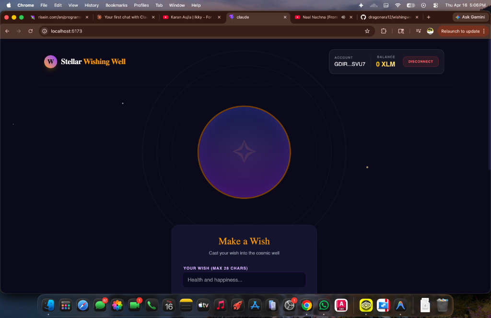
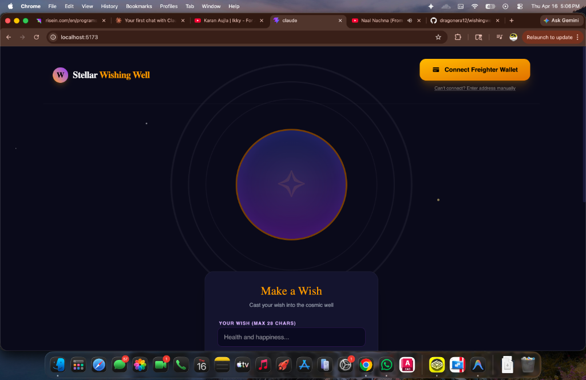
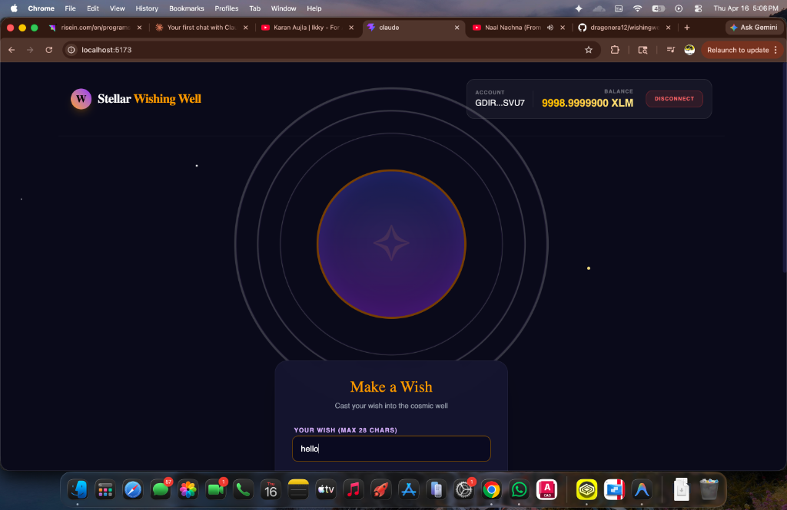
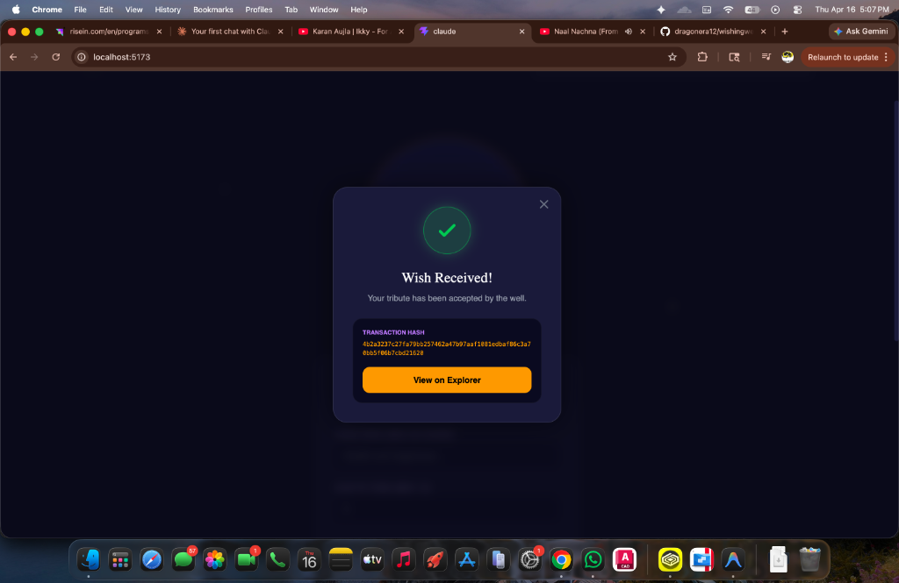
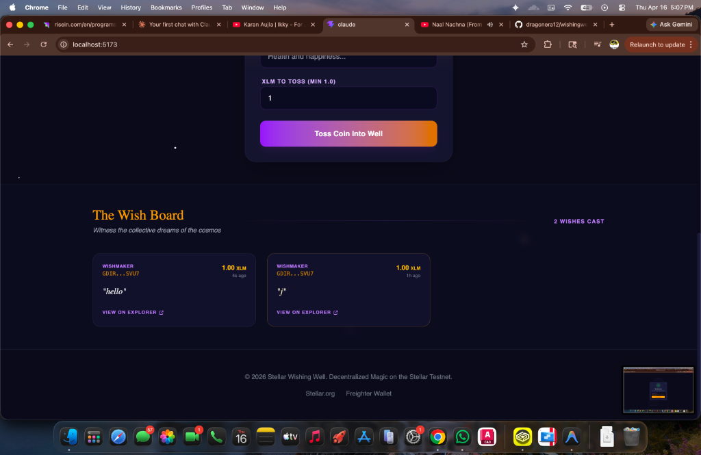

# 🔮 Stellar Wishing Well

A mystical, production-quality dApp built on the **Stellar Testnet**. Cast your wishes into the cosmic well and watch them become immortalized on the blockchain.



## ✨ Features

- **Blockchain Integration**: Real-time interaction with Stellar Testnet using `@stellar/stellar-sdk`.
- **Wallet Connection**: Seamless integration with the **Freighter** wallet for secure signing.
- **Mystical UI**: Elegant dark-mode interface with glassmorphic components and smooth CSS animations.
- **Wish Board**: Dynamic live-updating board showcasing the latest 10 wishes from the community.
- **Transaction Feedback**: Real-time success/error tracking with direct links to the Stellar Expert explorer.
- **Resilient Core**: Built-in retry logic, structural state stabilization, and native fetch bypass for maximum reliability.

## 📸 Screenshots

| Connection | Casting a Wish |
|------------|----------------|
|  |  |

| Success Receipt | The Wish Board |
|-----------------|----------------|
|  |  |

## 🚀 Getting Started

### Prerequisites

1.  **Freighter Wallet**: Install the [Freighter extension](https://freighter.app/) and set it to **Testnet**.
2.  **Node.js**: Ensure you have Node.js installed.

### Installation

1.  Clone the repository:
    ```bash
    git clone https://github.com/dragonera12/wishingwell.git
    cd wishingwell
    ```

2.  Install dependencies:
    ```bash
    npm install
    ```

3.  Configure environment variables:
    Create a `.env` file in the root:
    ```env
    VITE_WELL_ADDRESS=GA4YYRAAANSWHQ54JODWU6OVVOVQFCA4DFLXV6QR4OFU5KJJSBFGHGRV
    VITE_HORIZON_URL=https://horizon-testnet.stellar.org
    VITE_NETWORK_PASSPHRASE=Test SDF Network ; September 2015
    VITE_STELLAR_EXPERT_URL=https://stellar.expert/explorer/testnet/tx/
    ```

4.  Run the development server:
    ```bash
    npm run dev
    ```

## 🌌 How it Works

When you "toss a coin" into the well:
1.  The dApp builds a **Payment Operation** to the Treasury Account.
2.  Your wish text is attached as a **Memo (Text)** to the transaction.
3.  Freighter signs the transaction using your private key.
4.  The dApp submits the signed XDR to the **Horizon** network.
5.  Upon success, the wish is saved to local state and displayed for all to see.

---
Built with ✨ by dragonera12 & Antigravity.
📑 **License**: MIT
